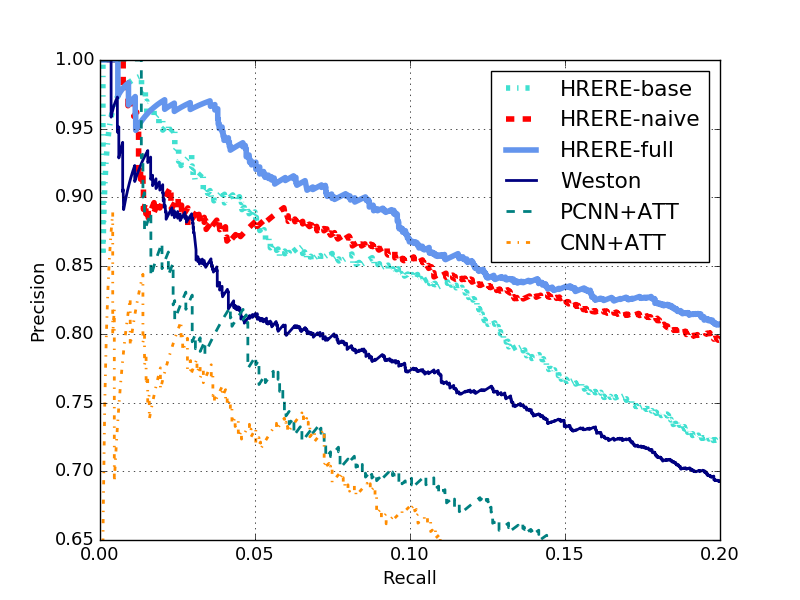

# HRERE

Connecting Language and Knowledge with Heterogeneous Representations for Neural Relation Extraction

Paper Published in NAACL 2019: [HRERE](https://arxiv.org/abs/1903.10126)

### Prerequisites

- tensorflow >= r1.2
- hyperopt
- gensim
- sklearn

### Dataset

To download the dataset used:

```
cd ./data
python prepare_data.py
```

### Preprocessing

Construct the knowledge graph:

```
python create_kg.py
```

Preprocessing the data:

```
python preprocess.py -p -g
```

### Complex Embeddings

Copy the fils in `./fb3m` to the data folder in [tensorflow-efe](https://github.com/billy-inn/tensorflow-efe) and run the following commands to obtain the complex embeddings:

```
python preprocess.py --data fb3m
python train.py --model best_Complex_tanh_fb3m --data fb3m --save
python get_embeddings.py --embed complex --model best_Complex_tanh_fb3m --output <repo_path>/fb3m
```

Then copy `e2id.txt` and `r2id.txt` in the `tensorflow-efe/data/fb3m` to `./fb3m` and run the following command:

```
python get_embeddings.py 
```

### Hyperparameters Tuning

```
python task.py --model <model_name> --eval <max_number_of_search> --runs <number_of_runs_per_setting>
```

`model_name` can be found in `model_param_space.py`. You can also define the search space by yourself.

### Evaluation

```
python eval.py --model <model_name> --prefix <file_prefix> --runs <number_of_runs>
```

`model_name` can be found in `model_param_space.py`. To replicate our results, use `best_complex_hrere` as the `model_name`.
It will run the model multiple times and calculate the means and stds of P@N which are logged in `./log`.
The predicted probabilities and labels of the first run are stored in `plot/output` for plotting PR curves.

### Results



After replicating the results, we find that the results on P@N(%) reported in the paper seem to be a bit over-optimisitic due to the variance.
According our replication based on 5 runs (`./log/replication.log`), the results are P@10% (0.849 +- 0.019), P@30% (0.728 +- 0.019), P@50% (0.636 +- 0.013).
We also report our scores to [NLP Progress](http://nlpprogress.com/english/relationship_extraction.html) based on this replication.

### Cite

If you found this codebase or our work useful, please cite:

```
@InProceddings{xu2019connecting,
  author = {Xu, Peng and Barbosa, Denilson},
  title = {Connecting Language and Knowledge with Heterogeneous Representations for Neural Relation Extraction}
  booktitle = {The 17th Annual Conference of the North American Chapter of the Association for Computational Linguistics: Human Language Technologies (NAACL 2019)},
  month = {June},
  year = {2019},
  publisher = {ACL}
}
```
